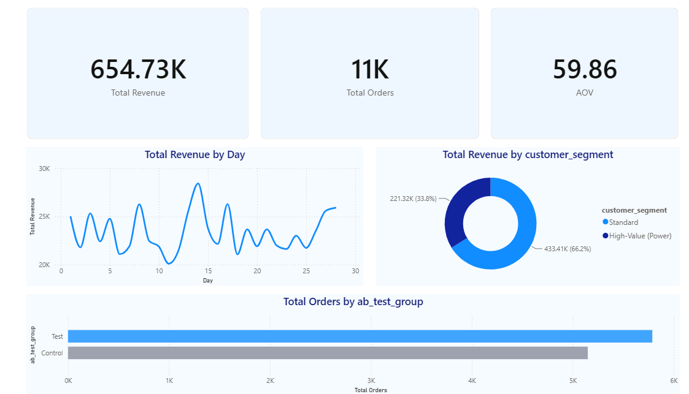

# Quick Commerce Product Analytics
An end-to-end data analysis project focusing on user retention, A/B testing, and customer segmentation for a quick-commerce application.

## 📊 Executive Dashboard

## 🎯 Key Business Insights (The "So What?")
1. **Cohort Revenue Concentration:** Segment analysis revealed a concentrated 'Power User' cohort that drives roughly 1/3rd of the total $654K revenue, despite being a very small fraction of the overall user base. **Action:** Recommend launching a premium subscription tier (similar to Zepto Pass) to lock in this high-value cohort and incentivize standard users to upgrade.
2. **A/B Test Results ('1-Click Reorder'):** The test group exposed to the new 1-click reorder feature successfully outperformed the control group, driving over 5.8K total orders compared to the control's ~5.1K. 
3. **Volume vs. Value:** With an average order value (AOV) of $59.86 across 11K orders, baseline engagement is healthy. However, time-series analysis (Total Revenue by Day) shows highly volatile, cyclic peaks. **Action:** Align inventory supply drops and promotional push-notification schedules specifically with these cyclic high-frequency days to stabilize the revenue floor.

## 🛠 Tech Stack
* **Data Transformation & Generation:** Python (Pandas, NumPy)
* **Metric Calculation & Aggregation:** SQL (PostgreSQL logic)
* **Visualization:** Power BI (DAX, DAX Measures)
